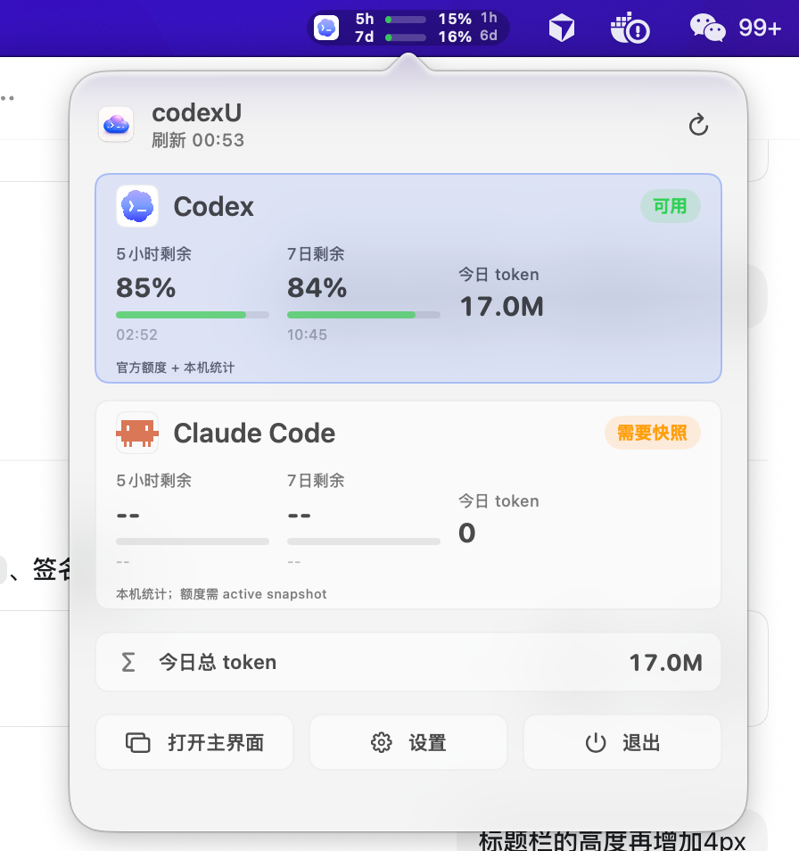

# codexU

> [!IMPORTANT]
> **Upgrade to v1.0.1 or later.** After Codex was integrated into the ChatGPT desktop app, the macOS app was renamed from `Codex.app` to `ChatGPT.app`. Older codexU versions still look for the previous path, which can prevent quota and usage data from loading. v1.0.1 supports the new app name while retaining legacy-path and standard CLI fallbacks. [Download the latest release](https://github.com/shanggqm/codexU/releases/latest).

codexU is a macOS menu bar and desktop app for tracking OpenAI Codex / ChatGPT Codex and Claude Code quota, token usage, and today's task status. It keeps the information you check most in the menu bar and main window, so you can quickly see remaining quota, reset times, and daily work progress.



## Who It Is For

- Developers who use OpenAI Codex, Codex CLI, or the Codex desktop app every day.
- Developers who use both Codex and Claude Code and want one local view for both runtimes.
- ChatGPT Pro / Team users who want a quick view of Codex 5-hour quota, 7-day quota, token usage, and reset times.
- macOS users who want to check Codex status without repeatedly opening a browser or terminal.

## Features

- Shows remaining and used Codex quota for the 5-hour and 7-day windows, including reset times.
- Adds a menu bar runtime menu with separate Codex and Claude Code cards, 5-hour/7-day remaining quota, today's token usage, and total tokens today.
- Offers Minimal, Classic, and Rich menu bar modes: Minimal wraps the runtime logo with two quota rings, Classic places each quota number inside its own progress ring, and Rich keeps full labels, bars, and reset times.
- Lets you switch menu bar quotas between used and remaining, choose 5-hour, 7-day, today tokens, and reset countdown, and keeps 5h/7d progress colors aligned with the main blue-purple quota rings.
- Adds a top-level `Codex | Claude Code` switch in the main widget so all panels can switch runtime scope manually.
- Supports Claude Code local transcript usage, 7-day trends, project rankings, top tools/Skills, and a basic task board.
- Summarizes token usage for today, the last 7 days, and lifetime totals with uncached input, cached input, and output splits.
- Estimates the current month's API-equivalent value from OpenAI API token prices and shows progress against Plus, Pro 100, Pro 200, and the full monthly quota value. The bar uses a segmented nonlinear scale, so movement past Pro 200 remains visible and is not a linear dollar ratio.
- Adds lower dashboard tabs for today's tasks, usage trend, project ranking, and Skill usage.
- Builds a daily task board from local Codex threads and enabled Codex automations, grouped into active, pending, scheduled, and done columns.
- Shows a six-month daily token heatmap, a last-7-day trend summary, and previous-period comparison.
- Shows recent and all-time project rankings with tokens, estimated value, thread counts, and recent activity.
- Shows top tool calls and top Skill usage to explain the structure of local Codex work.
- Runs as a standard macOS window with Dock, system window controls, minimization, and optional background running after the main window is closed. Closing the main window hides the Dock icon and keeps the menu bar item.
- Supports `Command + U` to show or hide the main window. The menu bar runtime menu can also open the main window, open settings, or quit.
- Includes a Settings window for Chinese/English UI text, system/light/dark appearance, menu bar content with live preview, always-on-top behavior, close-window behavior, system status, and update check configuration.
- Checks GitHub Releases for newer versions by default, including beta releases, and offers the DMG that matches the current Mac architecture. It does not silently download or install updates, and automatic checks can be turned off.
- Reads data locally and does not upload usage, threads, or account data to a third-party service.

## Keyboard Shortcuts

- `Command + U`: show or hide the main window. If the window is minimized, the shortcut restores it and brings it forward.
- Menu bar gauge icon: opens the runtime menu. Clicking a Codex or Claude Code card opens the main widget with that runtime selected.
- Menu bar runtime menu: shows quick Codex / Claude Code status and provides Open, Settings, and Quit actions.
- Settings window: configure language, appearance, menu bar mode/quota direction/visible metrics, always-on-top and close-window behavior, and control automatic checks or manually check GitHub Releases from the System section.
- Main-window refresh button: immediately refresh quota, token usage, trend, and task board.
- System window controls: close, minimize, or zoom the main window. After closing, reopen from the menu bar item or shortcut; quit from the menu bar runtime menu or the app menu.

## First Install: Privacy & Security

codexU is distributed outside the Mac App Store. On first launch, macOS may block it until you manually allow it:

1. Open `codexU.app` once. If macOS says it cannot be opened, cancel the dialog.
2. Open **System Settings > Privacy & Security**.
3. In the **Security** section, click **Open Anyway** for `codexU.app`.
4. Confirm with Touch ID or your password, then click **Open**.

You can also right-click `codexU.app` in Finder and choose **Open**, then confirm the same security prompt.

codexU needs access to local Codex data under `~/.codex/`. When Claude Code stats are used, it also reads local transcripts, tasks, and status cache files under `~/.claude/`. If macOS asks for file or folder access, allow it so the widget can read local usage, threads, and automation metadata.

## Install

Download the DMG for your Mac architecture from GitHub Releases:

- Apple Silicon: `codexU-<version>-mac-arm64.dmg`
- Intel: `codexU-<version>-mac-x86_64.dmg`

1. Open the DMG.
2. Drag `codexU.app` into the `Applications` folder.
3. Open codexU from `Applications`.
4. Complete the **First Install: Privacy & Security** steps above if macOS blocks the first launch.

After installation, codexU checks GitHub Releases for new versions at most once per day by default, including beta releases. The check reads public release metadata only. When an update is available, codexU opens the browser to download the DMG or view the Release page; installation remains manual. You can turn off automatic checks or run a manual check from the System section in Settings.

## Requirements

- macOS 14 or later.
- A local Codex installation.
- A signed-in Codex account for quota data.
- Codex must have been used at least once so `~/.codex/state_5.sqlite` exists.
- Claude Code support is optional. Historical tokens come from `~/.claude/projects/**/*.jsonl`; quota requires a local statusLine snapshot cache.
- Xcode Command Line Tools for building from source.

## Build From Source

```sh
make build
```

Run the app:

```sh
make run
```

Install to `/Applications`:

```sh
make install
```

Inspect the data source output:

```sh
make probe
```

## Package A DMG

```sh
make release
```

`make release` builds a DMG for the current build machine architecture. You can also build explicit Mac architectures:

```sh
make release-arm64
make release-intel
make release-all
```

Release artifacts are written to `dist/`, for example:

```text
dist/codexU-1.0.1-mac-arm64.dmg
dist/codexU-1.0.1-mac-arm64.dmg.sha256
dist/codexU-1.0.1-mac-x86_64.dmg
dist/codexU-1.0.1-mac-x86_64.dmg.sha256
```

For Developer ID signing and notarization, see [DISTRIBUTION.md](DISTRIBUTION.md).

## Data Sources

- Account and quota: `codex app-server` JSON-RPC methods `account/read`, `account/rateLimits/read`, and `account/usage/read`.
- Local token totals: `~/.codex/state_5.sqlite`.
- Detailed token splits: `token_count` events in `~/.codex/sessions/**/rollout-*.jsonl` and `~/.codex/archived_sessions/*.jsonl`.
- Today's board: unarchived and archived Codex threads in the local SQLite database.
- Usage trends and project rankings: aggregated from local session `token_count` events, with an approximate thread-updated-time fallback when detailed events are unavailable.
- Tool and Skill usage: tool call and Skill load records parsed from local session events.
- Scheduled tasks: enabled automation metadata under `~/.codex/automations/**/automation.toml`.
- Claude Code historical tokens: assistant `message.usage` fields in `~/.claude/projects/**/*.jsonl`.
- Claude Code tools, Skills, and tasks: transcript `tool_use.name` / explicit Skill attribution, plus `~/.claude/tasks/**/*.json`.
- Claude Code active quota: optional `~/Library/Caches/codexU/claude-code/statusline-snapshot.json`; without it, 5-hour and 7-day quota show `--`.
- Update checks: default access to the GitHub Releases API for public `shanggqm/codexU` release metadata, cached in `~/Library/Caches/codexU/update-check.json`.

Current Codex quota APIs expose rolling-window percentages and reset times, not absolute account quota sizes. Claude Code support reads local history and an optional active snapshot; it is not a Claude.ai official billing view. See [RESEARCH.md](RESEARCH.md) for the data model and fallback behavior.

## FAQ

### Is codexU an official OpenAI product?

No. codexU is an unofficial local macOS utility for reading local Codex app-server responses and local `~/.codex/` data.

### Does codexU upload my Codex threads or usage data?

No. codexU reads Codex quota, local SQLite usage, and automation metadata locally. It does not upload that data to a third-party service. Update checks only request public GitHub Release metadata and do not include local usage, threads, paths, logs, or account data.

### Why does codexU show remaining percentage instead of absolute quota?

The current local Codex API exposes rolling-window usage percentages and reset times, not absolute quota sizes. codexU therefore shows remaining percentages for the 5-hour and 7-day windows.

### Does codexU support Intel Macs?

Yes. Intel Macs should use `codexU-<version>-mac-x86_64.dmg`. From source, package it with `make release-intel`, or override `TARGET_TRIPLE="x86_64-apple-macos14.0"` from a compatible toolchain.

## License

MIT. See [LICENSE](LICENSE).

## WeChat Official Account

Scan the QR code to follow my WeChat official account for AI tools, Codex usage notes, and independent product building.


## User Community

Scan to join the Chinese-language codexU user community for usage tips, issue feedback, and open-source collaboration.


